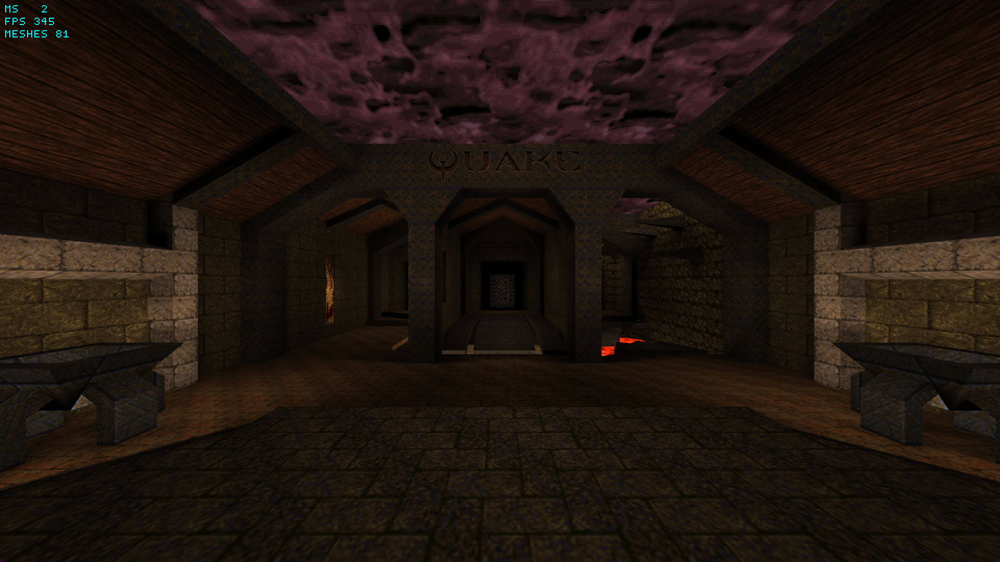

# Quake BSP Viewer



This viewer allows you to revisit original Quake (1996) maps. It is extreamly fast and only performs so many draw calls of how many textures are used in a single map. It features lightmaps and animated skies as well, what a lot of repositories on github don't do. The code is written in C++ and OpenGL 3.3.

There is also a small video that shows the viewer in action.
[https://www.youtube.com/watch?v=GT7dP5C2cZM](https://www.youtube.com/watch?v=GT7dP5C2cZM)

## Building

This project uses just a batch file to compile the project. So in order to compile the project make sure you have [Microsoft Visual C++ Build Tools](https://learn.microsoft.com/en-us/cpp/build/building-on-the-command-line?view=msvc-170) installed on your machine. You also need to compile from the *Developer Command Prompt* or run the [shell.bat](misc/shall.bat) to set the environment variables. All the dependencies are listed below. This project also makes use of a technique called [SCU](https://en.wikipedia.org/wiki/Single_compilation_unit).

```
misc\shell.bat
code\build.bat
```

## Dependencies
Make sure to have a look at the [build.bat](code/build.bat) file on where to put the dependencies.
+ [GLAD](https://glad.dav1d.de/#language=c&specification=gl&api=gl%3D3.3&api=gles1%3Dnone&api=gles2%3Dnone&api=glsc2%3Dnone&profile=compatibility&loader=on)
+ [glm](https://github.com/g-truc/glm/releases/tag/0.9.9.8)
+ [SDL2](https://github.com/libsdl-org/SDL/releases/tag/release-2.24.0)

## Controls

+ W - Move Forward
+ S - Move Backward
+ A - Strafe Left
+ D - Strafe Right
+ E - Move Upwards
+ Q - Move Downwards
+ LShift - Increase Speed

## References

Through the development I used the original source code of Quake and the unofficial BSP specification as a reference guide.
+ [https://github.com/id-Software/Quake](https://github.com/id-Software/Quake)
+ [https://www.gamers.org/dEngine/quake/spec/quake-spec34/](https://www.gamers.org/dEngine/quake/spec/quake-spec34/)