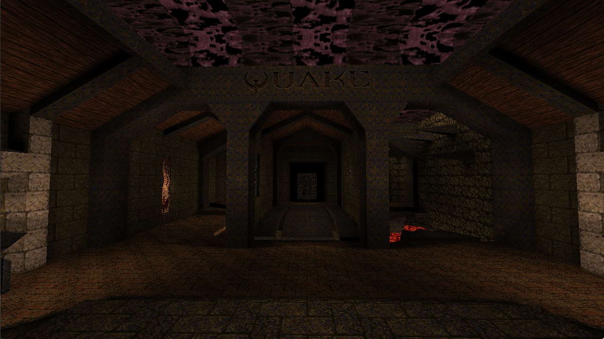

# Quake BSP Viewer



This is a work in progress Quake BSP viewer, that allows you to load original Quake maps and explore them with a fly through camera. The code was written in C++ and OpenGL a very C-Style way.

It dynamically creates a texture atlas for the lightmaps and calculates the s/t coordinates with their associated faces (this doesn't work in 90% of the cases).

## Building

This project was created with premake5 and was build with Visual Studio 2022. You need to provide two additional dependencies -> SDL2 and an OpenGL loader of your choice, I used GLAD.
This project also makes use of unity builds and builds really fast with only the main.cpp to be build.

```
premake5 vs2022
```

## Dependencies

This Project uses following external libraries
+ SDL2 for windowing/input
+ GLAD for modern OpenGL support

## Controls

+ W - Move Forward
+ S - Move Backward
+ A - Strafe Left
+ D - Strafe Right
+ E - Move Upwards
+ Q - Move Downwards


## References

+ [https://www.gamers.org/dEngine/quake/spec/quake-spec34/](https://www.gamers.org/dEngine/quake/spec/quake-spec34/)